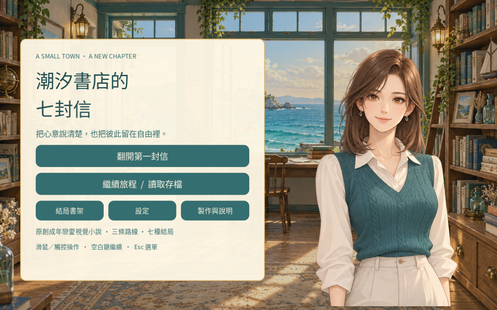
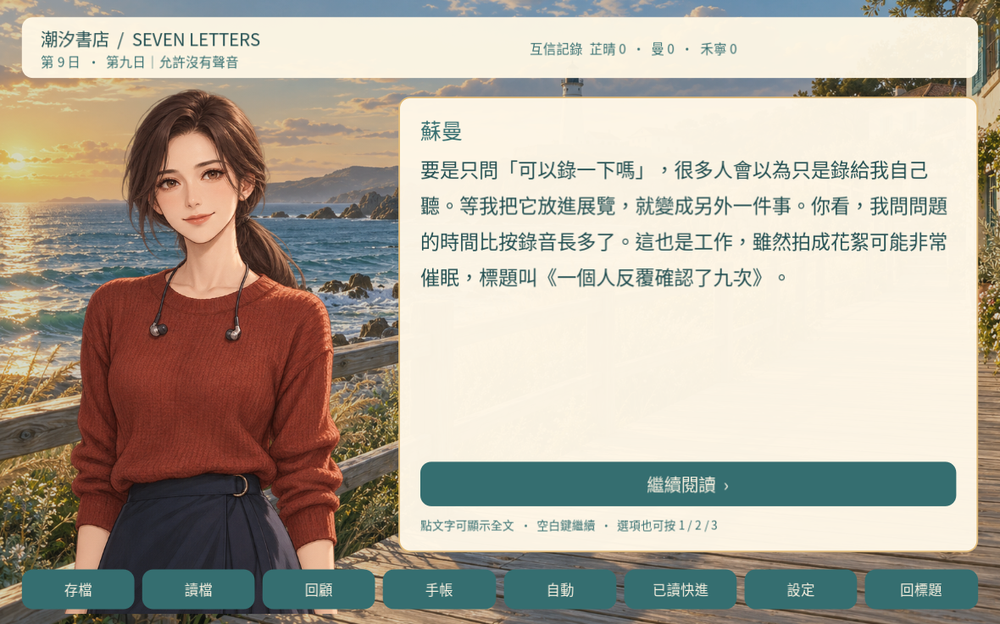
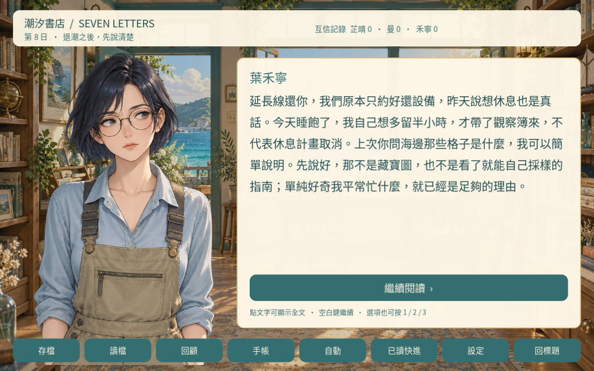

# 潮汐書店的七封信

一部原創繁體中文、全員成年、清新戀愛視覺小說。Godot **4.6.3** 製作，可玩至完整結局。

你是 27 歲的周予安，回到架空海邊小鎮「汐灣」，整理姑婆退休後交給你照顧的書店。七封獲准公開的信，牽起建築師林芷晴（26）、聲音設計師蘇曼（28）、海洋研究助理葉禾寧（25）的故事。

## 開始遊戲

- [網頁版](https://zuestrd20.github.io/tide-letters/)：入口頁按「在瀏覽器翻開故事」。首次需下載約 65 MB，要求 WebGL 2。單執行緒匯出，不需要 COOP／COEP。
- [Godot 原始碼與製作說明](https://github.com/zuestrd20/tide-letters)：公開主分支僅提供原始碼；Windows／Linux／Web ZIP 已完成製作，下載交付尚待完成。

## 下載與執行

目前 GitHub 主分支僅公開 Godot 原始碼，Pages 提供網頁版。下列四種套件已製作並驗證，但 Windows／Linux／Web ZIP 的下載交付尚待完成，這裡列的是檔名與執行方式，並非現成下載連結。

| 檔案 | 使用方式 |
|---|---|
| `TideLetters-Windows.zip` | 解壓後執行 `TideLetters.exe`，x86_64；未數位簽署 |
| `TideLetters-Linux.zip` | 解壓後執行 `TideLetters.x86_64`，必要時 `chmod +x TideLetters.x86_64` |
| `TideLetters-Web.zip` | 解壓後以 HTTP 靜態伺服器提供內容；不可直接用 `file://` 開啟 |
| `TideLetters-Godot-Source.zip` | 解壓後以 Godot 4.6.3 匯入 `project.godot`，按 F6/F5 執行 |

瀏覽器若顯示不支援 WebGL 2，請改用支援的裝置／瀏覽器，或自行從原始碼匯出原生版；預製原生 ZIP 的下載交付尚待完成。沒有帳號、廣告、分析追蹤或遊戲內交易。Windows 匯出成功但本次沒有 Windows OS 實機測試；詳細覆蓋請看下方。

## 遊戲內容與時長

- 499 個故事節點、29 個選擇節點、60 個選項。
- 7 封可重讀的信；3 條人物路線，各有戀愛／友誼結局；另有 1 個獨身結局，共 7 個。
- 全部分支「節點正文」實數 **41,229 漢字**；選項另有 1,020 漢字。信件手帳 1,355 漢字是正文中信件的重讀副本，不重複計入故事總量。
- 林芷晴單周目 17,339–17,466 漢字；蘇曼 17,523–17,693；葉禾寧 18,318–18,462；獨身 10,163–10,264。範圍取決於選項，未加未走分支或 metadata。
- 以 **300–600 漢字／分鐘**估算，人物路線正文約 29–62 分鐘；加上選擇與停留，建議預留 **35–75 分鐘**。獨身路線建議 20–45 分鐘。全分支文字量約 69–138 分鐘純閱讀，加上選擇與回看會更久；已讀快進可減少重複的共通段落。
- 上述是文字量推估，**不是真人完整計時遊玩結果**。最長節點 231 字元／205 漢字，對話與手帳皆可捲動。

## 功能與操作

- 滑鼠、觸控、鍵盤：空白鍵／Enter 繼續，1–3 選擇，Esc 開啟設定或關閉視窗。
- 點對話文字或按繼續可先展開全文；再次操作前進。
- 每段開頭自動存檔，另有 3 個手動槽。覆寫與遊戲內讀檔前會確認。讀檔會更新自動槽，重要分歧請先另存手動槽。
- 對話回顧、互信手帳、已收集信件、永久結局書架。
- 自動閱讀遇到選項停止；已讀快進需確認，只略過曾看過的段落，遇未讀或選項停下。
- 文字速度、音量、靜音；選項短暫防誤觸，回標題前確認。
- 1280×800 基準畫布等比例縮放，非標準比例保留背景邊界。建議橫向閱讀。
- 互信值只反映共同經歷，不是攻略分數門檻。結局由明確的對話選擇決定。

原生存檔位於 Godot `user://` 專案資料夾。Web 存檔存在目前瀏覽器／網站資料中；清除網站資料、隱私模式或更換瀏覽器可能使存檔消失。無雲端跨裝置同步。

## 截圖

以下由實際 Godot 遊戲視窗渲染擷取，未以圖片合成模擬 UI。為展示不同人物，截圖模式直接選定故事節點；這與另行完成的真實鍵鼠操作測試分開記錄。





## 建置

安裝 Godot 4.6.3 官方引擎及對應 export templates：

```sh
godot --headless --path . --editor --quit
python3 tests/validate_story.py
godot --headless --path . -- --self-test
godot --headless --path . --export-release Linux
godot --headless --path . --export-release Windows
godot --headless --path . --export-release Web
cp tools/web_index.html builds/web/index.html
```

CI／測試時請設定獨立且可寫的 `XDG_DATA_HOME`，以免測試存檔與正式遊玩存檔混用。輸出在 `builds/`，Git 會忽略該目錄。

## 驗證結果與限制

- `tests/validate_story.py`：499 節點全部可達、無環與死路；所有 choices 有合法目標；7 結局與 7 封信可達；所有背景、表情資產存在。完整路徑與字數見 `tests/story_report.json`。
- Godot headless 自測：7 個結局各走一條合法完整路徑（168–245 節點），選擇會套用互信與旗標；開始與各結局的存／讀回復、modal 暫停、重複關閉與快進取消均通過。
- 獨立 QA：逐一測試 60 個選項、文字展開、手動與自動存檔隔離、覆寫／恢復、auto／skip 在選項停止、防連點、未讀停止；損壞 JSON、未知版本及錯型別存檔安全拒絕，profile 設定會檢驗與夾限。
- 真實 Linux 原生視窗：滑鼠啟動、空白鍵推進至第一選項、數字鍵選擇、互信回饋、手動存檔、推進後讀檔確認與正確恢復、設定速度／靜音與 Esc 關閉皆實際操作確認。畫面已目視檢查，繁中文字與透明立繪正常。
- Linux／Windows／Web 匯出成功。**Windows 尚未在 Windows OS 實玩；Web 未完成 GPU 遊玩驗證**。Web 靜態資產與單執行緒設定可驗證，但不能等同瀏覽器完整通關。
- 圖片為生成素材，並不宣稱人工繪製；沒有角色配音。相關客觀限制不會以自動測試取代。

## 原創性、素材與授權

- 劇情、角色設定、程式與合成音樂由 AI 協作為本作原創撰寫；並非熱門遊戲或影視作品改編。三名女角及男主皆成年，尊重同意與自主選擇，沒有露骨色情內容。
- 9 張角色立繪（3 人×3 表情）與 4 張背景均由內建影像生成工具製作。同一角色的三表情來自同一生成 sheet，只做無損矩形裁切，保留原始 RGBA 透明度；沒有後製重繪或下載第三方角色。
- 原始生成圖在 `assets/originals/`；完整提示詞、來源與裁切框在 `assets/art_manifest.json`；像素／雜湊 QA 在 `assets/art_qa_report.json`。Manifest 的來源路徑全部相對於專案根目錄；執行素材均已放入專案內，`data/art.json` 使用相對 `res://` 路徑。
- 48 秒原創合成循環配樂與翻頁音：`tools/generate_audio.py`（NumPy），無外部音樂／取樣素材。
- 字型為 Noto Sans CJK TC，源自系統 Noto Sans CJK 字型集 TC 字面，授權 SIL Open Font License。完整授權見 `assets/fonts/LICENSE.txt`。
- Godot Engine 4.6.3 採 MIT，見 https://godotengine.org/license/ 與官方第三方授權 https://godotengine.org/license/thirdparty/ 。
- 本專案程式、原創文字及可授權部分依 `LICENSE`（MIT）提供；字型保留其原授權。生成素材依適用工具條款使用，不保證各司法管轄區的著作權保護資格，也不主張生成圖的排他權。

最長信件段落已在真實原生視窗以滑鼠滾輪捲到底，最後署名完整可讀；三選項版面也已檢查沒有溢出或重疊。
